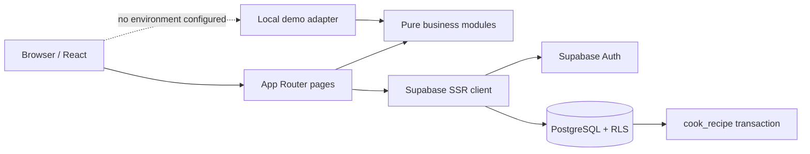

# Architecture

Smart Fridge is a Next.js App Router application organised into presentation, domain, data-access, and database layers.

The local demo adapter uses the same domain functions and data shapes as the production path. It is intentionally visible as “Demo data active” and persists only in `localStorage`. Production deployments configure Supabase environment variables, at which point the Next.js route proxy protects private routes and refreshes sessions.

Business modules are deterministic and side-effect free. Recommendation order is allergy filter, diet filter, match, missing items, near-expiry detection, then ranking. The `cook_recipe` function is the transactional boundary for production deductions.

## Standards

- TypeScript strict mode and Zod at form boundaries.
- RLS and `auth.uid()` ownership checks are the final authorisation boundary.
- No service-role credential is used by browser code.
- Semantic controls, visible focus, text validation, responsive layouts, and non-colour status labels support accessibility.
- Errors shown to users contain actionable context but no secrets or database internals.
