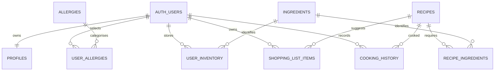

# Database design

## Entity relationship diagram

## Data dictionary

| Entity | Important fields | Notes |
|---|---|---|
| profiles | id, display_name, dietary_preference, health_goal, religious_restriction, setup_completed | `id` is also the Auth user FK |
| allergies | id, name, normalized_name | Reference; generated normalised unique key |
| user_allergies | user_id, allergy_id or custom_name | Exactly one allergy source; duplicate constraints |
| ingredients | id, name, category, allergen_ids | Stable IDs are used for matching |
| user_inventory | user_id, ingredient_id, quantity, unit, storage_location, dates, expiry_source | Positive quantity and valid date range |
| recipes | name, instructions JSON, prep time, difficulty, servings, diet | Reference data |
| recipe_ingredients | recipe_id, ingredient_id, required_quantity, unit, is_optional | Unique recipe/ingredient pair |
| shopping_list_items | owner, ingredient/name, quantity/unit, recipe, purchased | Manual or recipe-derived |
| cooking_history | owner, recipe, cooked_at, servings, deduction JSON | Written by cooking transaction |

## RLS verification

Every user-owned policy compares its owner column to `auth.uid()`. Reference-table policies permit only authenticated `SELECT`; no client write policy exists. Cooking history has no client insert policy because the narrowly scoped `security definer` cooking function owns that controlled workflow, filters every inventory operation by `auth.uid()`, and is executable only by authenticated users.

Create `alex@smartfridge.demo` through Supabase Auth, then resolve its UUID and insert inventory/allergy rows with that `user_id` while running an administrator seed session. Never embed the demo password or service-role key in repository files.
